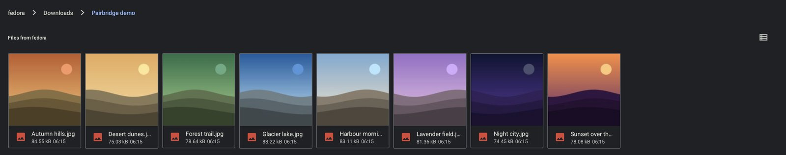
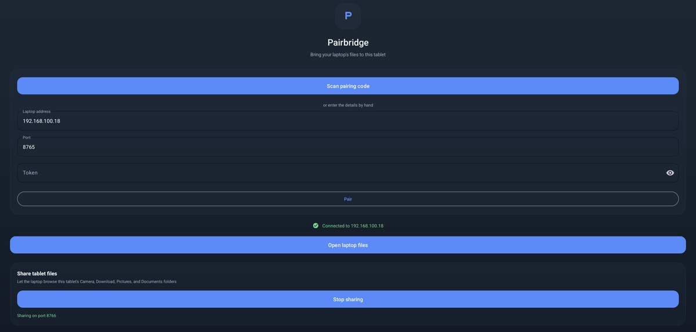
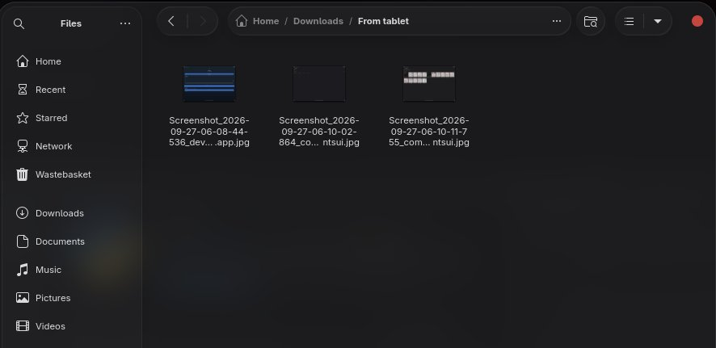

# Pairbridge

[](https://github.com/MrtnOmwenga/pair-bridge/actions/workflows/ci.yml)

Share files between a Linux PC and an Android tablet over the local network, without a cloud
service or a cable.

- **Your PC's folders on the tablet.** The PC shows up as a storage location, named after the
  PC, in every Android file picker (Slack's, WhatsApp's, the Files app), the same way
  Google Drive does. Browse with thumbnails, open files, attach them anywhere.
- **Save to the PC from any app.** "Save to", new folder, rename and delete all work on the PC's
  folders.
- **Send to PC from the share sheet.** Share photos, files or a link from any app and they land
  in `~/Downloads/From tablet`.
- **Pair by scanning a QR code.** If the PC's IP address changes, the app finds it again over
  mDNS.



## Quick start

**On the PC** (Linux with systemd; tested on Fedora):

```sh
pipx install "git+https://github.com/MrtnOmwenga/pair-bridge#subdirectory=laptop"
pairbridge install
```

`pairbridge install` asks which of Downloads, Documents, Pictures and Videos to share, installs a
background service that starts at login, warns if the firewall would block the tablet, and shows
a pairing QR code.

**On the tablet**, build and install the app (Android 8+):

```sh
cd android
./gradlew assembleDebug
adb install app/build/outputs/apk/debug/app-debug.apk
```

Open Pairbridge, tap **Scan pairing code**, and scan the QR code. The PC now appears in file
pickers; **Open laptop files** in the app jumps straight to it.



Anything shared with **Send to laptop** lands in `~/Downloads/From tablet`:



> **Xiaomi / HyperOS:** a first install over adb can fail with `INSTALL_FAILED_USER_RESTRICTED`.
> Copy the APK instead (`adb push app-debug.apk /sdcard/Download/`) and install it from the Files
> app; later updates install over adb normally. Xiaomi's own file manager doesn't list other
> apps' storage locations, so use **Open laptop files** or any app's file picker.

## The `pairbridge` command

| Command | What it does |
|---|---|
| `pairbridge install` | Run the server in the background at login, then show the pairing code |
| `pairbridge pair` | Show the pairing QR code again (`--show-token` to pair by hand) |
| `pairbridge status` | Whether the service is running, the address, PC name, inbox and shared folders |
| `pairbridge share list` / `add <folder>` / `remove <id>` | Choose what the tablet can see; applies immediately |
| `pairbridge logs` | Follow the service's log |
| `pairbridge serve` | Run the server in the foreground |
| `pairbridge uninstall [--purge]` | Remove the service (`--purge` also deletes the config and pairing) |
| `pairbridge mount <dir>` | Experimental: mount the tablet's folders (see [Limitations](#limitations)) |

Configuration lives in `~/.pairbridge/config.json`. Set `"name"` there to change how the PC is
labelled on the tablet (the default is the PC's hostname).

## Design

```
PC (Linux)                                   Android tablet
──────────                                   ──────────────
FastAPI server  ◄─── list / download ─────── DocumentsProvider (Storage Access Framework)
  shared-folder allowlist                      every file picker sees the PC as a root
  bearer-token auth       ◄─── write / create / rename / delete
  thumbnails (Pillow)
  inbox for sent files    ◄─── upload ────── Share-sheet activity ("Send to laptop")
  mDNS announcement       ···· discovery ··· finds the PC after its IP changes
```

**The tablet only ever opens connections to the PC.** HyperOS silently drops inbound connections
to regular apps over WiFi ([investigation](docs/hyperos-wifi-investigation.md)), so every shipped
feature is built on outbound requests: sending to the PC is an upload from the tablet rather than
the PC pulling from a server on the tablet.

Decisions worth knowing about:

- **Opening a file shouldn't wait on the network.** Android's WiFi radio powers down after a few
  seconds idle, and the next packet costs 1–3 s regardless of size (measured by matching server
  and app log timestamps). When a folder is listed, files under 10 MB download in the background
  into a cache keyed by path, size and modification time, so a tap is served from disk. The
  trade-off: a file changed on the PC is only noticed when its folder is listed again.
- **Background work can't slow the file you tapped.** Preloads run one at a time and thumbnail
  fetches are capped at three, leaving bandwidth and connections for interactive requests.
  Thumbnails are rendered on the PC, so scrolling a photo folder transfers kilobytes, not
  full-size images.
- **Streams, not copies.** Downloads and writes go through pipes between the app and the HTTP
  connection, so large files never sit in memory or in a temp copy on the tablet. Failures are
  reported through the pipe, so an app never receives a truncated file as if it were complete.
- **Writes on the PC are atomic.** Uploads go to a temp file that's renamed into place once the
  body is complete; a dropped connection leaves the original file untouched. Files sent to the
  inbox never overwrite each other (`IMG.jpg`, `IMG (1).jpg`, ...).

### HTTP API

All endpoints except `/health` need `Authorization: Bearer <token>`. Paths are relative to a
shared folder (`root`).

| Endpoint | Purpose |
|---|---|
| `GET /roots` | Shared folders, plus the PC's name and id |
| `GET /files`, `GET /files/stat` | List a folder, describe one entry |
| `GET /files/download`, `GET /files/thumb` | File content, JPEG thumbnail |
| `PUT /files/content` | Replace a file's content (streamed, atomic) |
| `POST /files/create`, `POST /files/rename`, `DELETE /files` | Folder and file management |
| `POST /inbox` | Receive a file from the share sheet |

## Security model

- **Only the folders you share are visible.** Every path is resolved against its shared folder
  and rejected if it escapes, including through symlinks. Your home folder as a whole can't be
  shared.
- **Pairing token.** A 256-bit random token, compared in constant time. On the PC it's stored in
  `~/.pairbridge/config.json`, readable only by your user; on the tablet it's encrypted with an
  Android Keystore key. It's only displayed when you run `pairbridge pair`.
- **Not protected against others on your WiFi.** Traffic is plain HTTP, so someone on the same
  network who captures the token can read and change your shared folders. Use Pairbridge on
  networks you trust, and share only what you need. TLS with the certificate pinned through the
  QR code is on the [roadmap](ROADMAP.md).

## Limitations

- Plain HTTP on the local network; see the security model.
- Apps that edit a file in place ("rw" mode) can't save to the PC; saving a new or replaced file
  works.
- **Tablet → PC mounting is experimental.** `pairbridge mount` needs the app's "Share tablet
  files" server, which HyperOS blocks over WiFi. Use **Send to laptop** instead.
- The PC side needs Linux with systemd for `pairbridge install`; `pairbridge serve` runs anywhere
  Python does.

## Development

```
laptop/     the pairbridge Python package (FastAPI server, CLI, config) and its tests
android/    the Kotlin app (DocumentsProvider, share activity, pairing, mDNS discovery)
docs/       design notes and investigations
```

```sh
cd laptop
python3 -m venv .venv && .venv/bin/pip install -e '.[dev]'
.venv/bin/pytest
```

The tests cover authentication, path-traversal and symlink escapes, atomic writes, upload limits,
collision-free naming, thumbnails, config file permissions and the CLI. CI runs them and builds the
APK on every push.

## License

[MIT](LICENSE)
